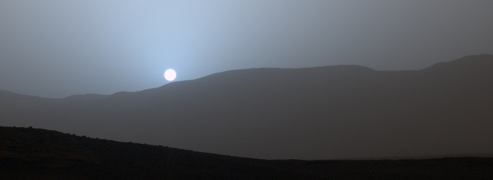

## Begin Transmission

Many years ago, Andy Weir released the Martian.  There was a certain magic to it, and it got folks asking a lot of interesting questions.  At this time I was already deeply fascinated with space, but it got me thinking.  Namely, if you were stranded on Mars with no hope of rescue, how would you survive?  What technologies would be required?  What would you need to build and develop, and what are the minimum starting resources required for survival?  
  
This project sets out to begin answering some of these questions (to the best of my ability as a spacecraft engineer).  In the chapters below, I will be taking the role of a castaway martian, marooned on a strange planet with nothing but minimal gear and his own wits to keep him alive.  

My audience is people interested in learning more about the math and engineering behind space travel.  To that end, I make a few assumptions in most of my explanations.  Namely that you have a decent understanding of Calculus, matrix math (working with matrices and vectors), and some basic experience with programming (Python and some C++).  My hope is that these articles can serve as both tutorials for people interested in these concepts as well as a compelling read to follow along to show just what is involved in getting humans to survive on their own in the deep cosmos.  

Please enjoy!  
-/EoT/ - Martian Castaway

---

### Chapter 1 - landing
In this series I cover how to perform celestial navigation using Kerbal Space Program.  This includes orbital mechanics, planetary analysis with computer vision, optimal trajectory generation, and more.
1. [Damage Report](introduction/2020/03/17/damage-report.html) - in depth overview of the situation, descriptions of various spacecraft sensors
2. [Taking Control](introduction/2020/03/18/taking_control.html) - Connecting to my spacecraft
3. [Navigation Online](introduction/2020/04/07/Navigation_Online.html) - Using Euler Integration to plot orbital dynamics
4. [Eyes On](introduction/2020/05/07/Eyes_On.html) - Monocular surface reconstruction to determine good landing zones
5. [Shoot for the Moon](2020-03-18-taking_control.md) - COMING SOON! Utilizing shooting methods to calculate an optimal burn to land my ship
6. [Structurally Sound](2020-03-18-taking_control.md) - COMING SOON! Creating a finite element solver to validate stress limits on the spacecraft
7. [G-FOLD](introduction/2020/05/09/G-FOLD.html) - Writing a convex fuel optimal trajectory calculation system
8. [Contact Light](introduction/2020/05/18/Contact_Light.html) - Building a trajectory tracking algorithm 

---

### Chapter 2 - breaking ground
This series is more hardware oriented.  I build some systems to help me produce tools and other necessities to keep me alive.
1.  [Fire in The Disco](setup/2020/10/24/FIRE.html) - building an inert gas fire supression sytem
2.  [Right tool for the job](setup/2020/11/11/toolbox.html) - building a toolbox to house my electronics
3.  [Breate Easy](setup/2020/11/15/breath_easy.html) - creating a bioreactor to grow plankton to sequester CO2

---